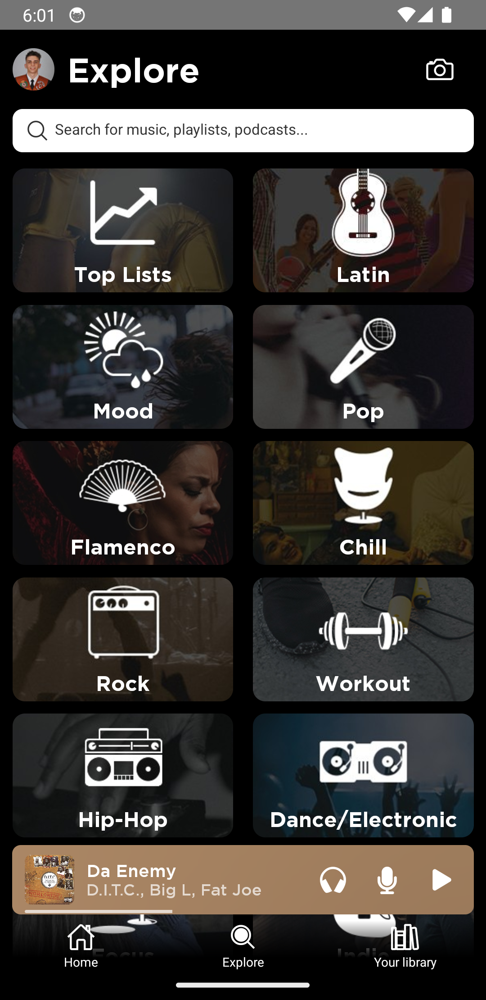

# Spotify Clone App

[](https://github.com/Marquez-David/SpotifyClone/blob/main/LICENSE)

## Table Of Content

- [Description](#description)
- [Structure](#structure)
- [Installation & Prerequisites](#installation)
- [Todo](#todo)

## Description
This project is a clone of the popular music streaming application, Spotify. It has been developed using React Native, and the [Spotify API](https://developer.spotify.com/documentation/web-api) for music data. As of now, please note that the project is exclusively supported for Android devices.  

<br>

| LoginScreen | HomeScreen | ExploreScreen | LibraryScreen |
|:---------------:|:---------------:|:---------------:|:---------------:|
|  |  |  | 
| ArtistScreen | AlbumScreen | PlaylistScreen | PodcastScreen |  
 |  |  | 

## Structure

Inside the directory we can find the different functionalities developed for the correct functioning of the project. The structure of the project can be summarized as follows:

1. `Components` #Contains all the source code and style files for the custom components.
2. `Navigation` #This Navigation directory is responsible for handling the navigation logic of the application. It defines the routes, screens, and navigation stacks.
3. `Screens` #This directory consists of all the individual screens or views of the application. Each screen represents a specific user interface (UI) that the user can interact with. 
4. `Services` #Contains code responsible for connecting with Spotify APIs.
5. `Utils` #Contains helper functions that are used across different parts of the application.
6. `Assets` #The Assets directory is used to store static files, such as images, fonts, or other resources required by the project.
7. `Hooks` #This directory contain custom hooks that are used across the application.
8. `Context` #The Context directory holds the context providers and related code for managing the global state of the application, allowing data to be shared and accessed across different components and screens.

Before installation, make sure you are inside the source main directory.

## Installation

>**Note**: Make sure you have completed the [React Native - Environment Setup](https://reactnative.dev/docs/environment-setup) instructions till "Creating a new application" step, before proceeding.

## Step 1: Clone the repository
```js
git clone https://github.com/Marquez-David/SpotifyClone.git
```

## Step 2: Start the Metro Server

First, start **Metro**, the JavaScript _bundler_ that ships _with_ React Native.

To start Metro, run the following command from the _root_ of your React Native project:

```bash
# using npm
npm start

# OR using Yarn
yarn start
```

## Step 3: Start the Application

Let Metro Bundler run in its _own_ terminal. Open a _new_ terminal from the _root_ of your React Native project. Run the following command to start your _Android_ or _iOS_ app:

### For Android

```bash
# using npm
npm run android

# OR using Yarn
yarn android
```

If everything is set up _correctly_, you should see your new app running in your _Android Emulator_ shortly provided you have set up your emulator/simulator correctly.

## Todo
🚀 This project is still under development and may undergo changes in the future!! 🚀. Below is a list of upcoming tasks:

- Implement advanced functionalities for creating and managing playlists.
  - [ ] Playlist creation with customizable details.
  - [ ] Intuitive drag-and-drop reordering of playlist items.
  - [ ] Add songs to playlists.

- Create a player screen with interactive playback controls.
  - [ ] Seamless song skipping, resetting, and pausing functionalities.
  - [ ] Visual progress indicators and album artwork display.
  - [ ] Integration of gesture controls for an intuitive user experience.

- Enhance the functionalities of custom buttons.
  - [ ] Develop onPress for download, options... buttons.
  - [ ] Develop LoginScreen buttons for different authentication methods.

- Extend project compatibility to iOS devices.
  - [ ] Adapt the UI/UX for seamless performance on iOS.
  - [ ] Address platform-specific considerations for a native feel.
  - [ ] Comprehensive testing on iOS devices and simulators.


